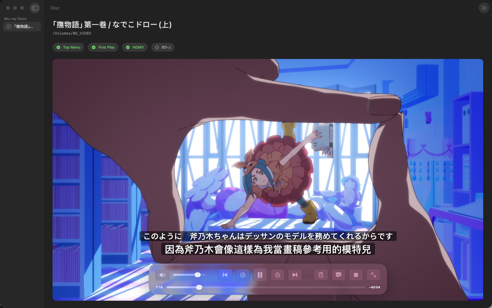

<p align="center">
  
</p>

<h1 align="center">BD Menu Player</h1>

<p align="center">
  <strong>A native Apple Silicon Blu-ray player that keeps the disc menu.</strong>
</p>

<p align="center">
  Original HDMV navigation, external bilingual subtitles, hardware decoding<br>
  and a Liquid Glass interface — built for modern macOS.
</p>

<p align="center">
  <a href="https://github.com/Zichao-xu/BDMenuPlayer/releases/latest">下载</a> ·
  <a href="#功能">功能</a> ·
  <a href="#快捷键">快捷键</a> ·
  <a href="#构建">构建</a> ·
  <a href="#法律与版权">法律与版权</a>
</p>

<p align="center">
  <a href="https://github.com/Zichao-xu/BDMenuPlayer/releases"></a>
  
  
  <a href="LICENSE"></a>
</p>

---

<p align="center"></p>

<p align="center"><sub>Original Blu-ray menu playback with bilingual external subtitles.</sub></p>

## 功能

- 读取已挂载的 Blu-ray，识别 First Play、Top Menu、HDMV 与 BD-J 能力
- 使用原始 HDMV 菜单，而不是把光盘降级成普通视频文件
- 通过 LibVLC 与 VideoToolbox 在 Apple Silicon 上进行硬件辅助播放
- 支持 ASS、SSA、SRT 外挂字幕与双语字幕叠加显示
- 可将两集字幕按光盘主片章节边界自动衔接
- 窗口只显示画面；单行 Liquid Glass 控制栏随鼠标出现、静止 2 秒或移出窗口即隐藏，光标与窗口按钮一并隐藏
- 插入光盘自动进入菜单；光盘信息与外挂字幕收在控制栏的 ⓘ 弹窗中
- 原生 macOS 全屏
- 插入/弹出光盘自动刷新；缺少解密后端或打不开光盘时明确提示原因
- 支持章节切换、±10 秒、进度跳转、音量、静音和菜单导航
- 自动发现用户自行安装的 MakeMKV/libmmbd 解密后端

> [!IMPORTANT]
> BD Menu Player 不包含密钥、解密组件、影片、字幕或任何光盘内容。
> 加密光盘需要用户合法安装并激活兼容后端。

## 快捷键

| 操作 | 快捷键 |
|---|---|
| 播放 / 暂停 | `Space` |
| 后退 / 前进 10 秒 | `J` / `L` |
| 静音 | `M` |
| 上一章 / 下一章 | `PageUp` / `PageDown` |
| 停止 | `⌘.` |
| 打开 / 关闭光盘弹出菜单（返回） | `P` / `Delete` |
| 全屏 | `F` |
| 菜单方向 / 播放时快退快进 | 方向键 |
| 激活菜单项目 | `Return` |
| 选择外挂字幕 | `⇧⌘O` |

## 系统要求

- Apple Silicon Mac
- macOS 26 或更高版本
- Xcode 26+ / Swift 6.2+（仅自行构建时需要）
- Homebrew `libbluray` 1.5+（仅自行构建时需要，Release 已内置）
- 加密商业光盘：用户自行安装的 MakeMKV（可选、不会随本项目分发）

当前版本仅面向 Apple Silicon。Intel Mac 尚未测试。

## 下载

从 [Releases](https://github.com/Zichao-xu/BDMenuPlayer/releases/latest)
下载 `BDMenuPlayer-v<版本>-arm64.zip`，解压后运行应用。libbluray 已打包进
应用，无需再装 Homebrew。

这是未经 Apple 公证的早期预览版。首次启动时，macOS 可能要求你在
**系统设置 → 隐私与安全性** 中确认打开。

插入光盘后会自动识别。若光盘使用 AACS 加密而本机没有可用的解密后端，
播放区会直接说明原因并给出安装 MakeMKV 的入口；装好或激活后点“重新检测”即可。

## 构建

```sh
git clone https://github.com/Zichao-xu/BDMenuPlayer.git
cd BDMenuPlayer
brew install libbluray
scripts/setup-vlc.sh
scripts/build-app.sh
open .build/BDMenuPlayer.app
```

`setup-vlc.sh` 会从 VideoLAN 下载官方 Apple Silicon VLC 3.0.23 运行时。
也可以将本地 `VLC.app` 路径作为第一个参数传入。VLC 二进制保存在被 Git
忽略的 `Dependencies/` 中，不会提交到源码仓库。

运行测试：

```sh
swift test
```

物理光盘集成测试默认跳过。要启用它们，可设置：

```sh
export BD_MENU_PLAYER_TEST_DISC="/Volumes/your-disc"
```

## 架构

| 组件 | 用途 |
|---|---|
| SwiftUI + AppKit | 界面、全屏、输入和视频宿主视图 |
| LibVLC | 解码、菜单导航、音频与视频输出 |
| libbluray | 光盘结构、标题、章节及菜单能力探测 |
| MakeMKV / libmmbd | 用户可选安装的 AACS / BD+ 运行时后端 |

## 当前限制

- BD-J 菜单取决于 VLC/libbluray 的 Java 运行环境，尚未完整验证
- Release 为临时签名，尚未加入 Developer ID 公证流程
- 目前只发布 Apple Silicon 构建
- 光驱、光盘结构和第三方解密后端的兼容性仍可能存在差异

## 法律与版权

本项目用于播放用户合法拥有的介质，不提供或分发解密密钥、受版权保护的
影音内容或字幕。不同地区对光盘访问与技术保护措施的规定不同，请自行确认
当地法律并遵守光盘及第三方软件许可。

项目源码采用 [MIT License](LICENSE)。第三方组件及其许可见
[THIRD_PARTY_NOTICES.md](THIRD_PARTY_NOTICES.md)。

## 致谢

感谢 [VideoLAN](https://www.videolan.org/) 的 VLC 与 libbluray 项目，以及
所有帮助测试不同光盘、字幕和 macOS 版本的贡献者。
